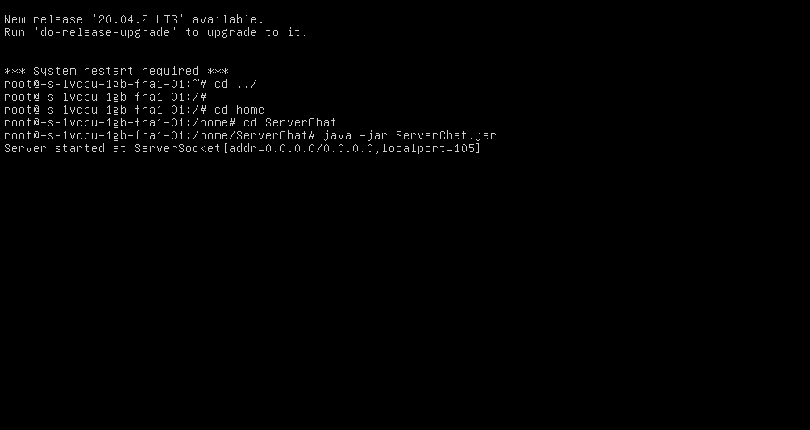
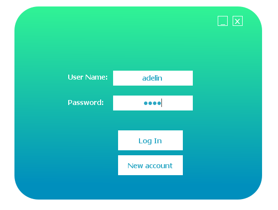
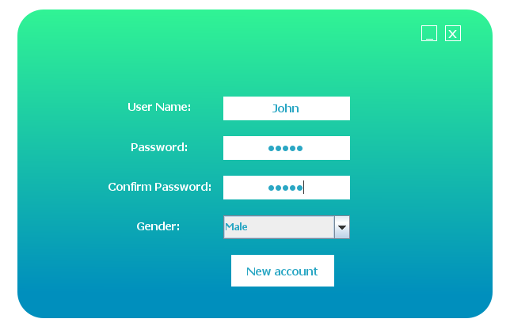
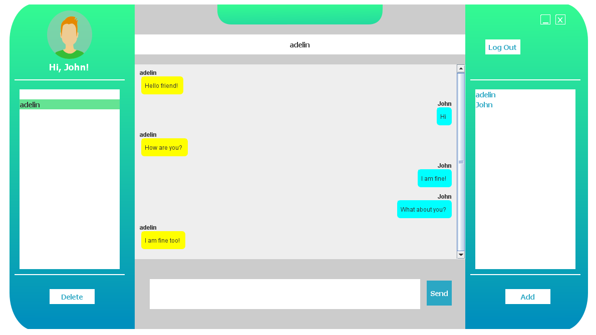
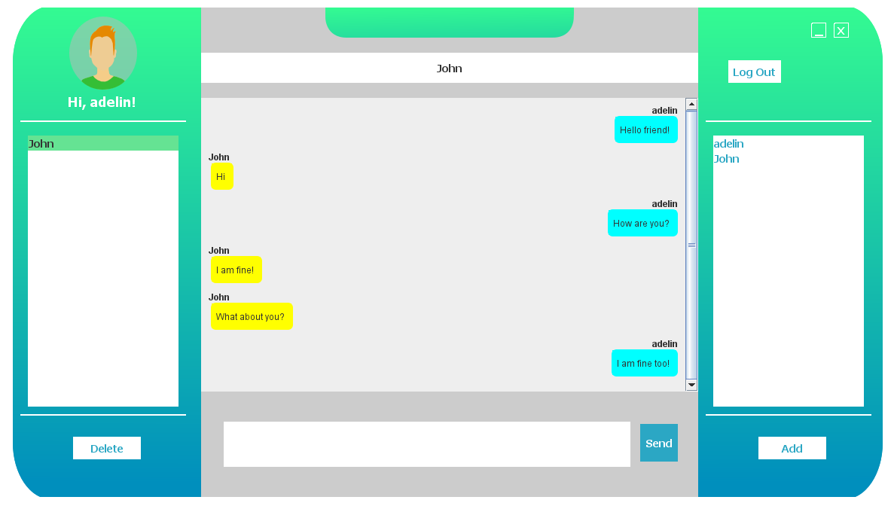

# Chatting-Application

Desktop application for communicating with your friends!

- Two main parts:
    - Client:
        - Log in module
        - New user module
        - Main app module
    -Server:
        - Manipulate each user using a Server Thread
        - Communicate with database using Controller module

- A user can connect from everywhere sending and receiving information from other users because the Database Server and the backend Controller are host on a VPS

- Sent messages are stored even if the user logged out

- Real time communicating 

- Some screenshots from the app:

